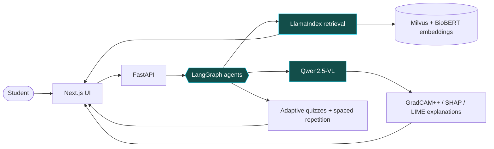

<!-- <div align="center">


# Hi, I'm Emad Hasan 👋

### AI Engineer · RAG & LLM Systems · Agentic AI

**I build AI systems that make complex work feel simple.**

<a href="https://emad-hasan-portfolio.vercel.app/">
  
</a>

<p>
  <a href="https://emad-hasan-portfolio.vercel.app/"></a>
  <a href="https://www.linkedin.com/in/emad-hasan7/"></a>
  <a href="mailto:emadhasan188@gmail.com"></a>
</p>

BSc Artificial Intelligence, FAST NUCES

</div>

---

## About me

I'm an AI engineer working across **retrieval-augmented generation, LLM fine-tuning, and agentic workflows**. My projects span healthcare, finance, and public-sector data, with a focus on grounding answers, evaluating model behavior, and turning prototypes into useful applications.

- **Building:** RAG pipelines with hybrid retrieval, reranking, citations, and verification.
- **Adapting:** Open-source LLMs with QLoRA, PEFT, and memory-efficient training.
- **Shipping:** AI APIs and full-stack applications with FastAPI, Docker, and Next.js.
- **Exploring:** Cloud MLOps, inference optimization, and dependable agent orchestration.

## Toolbox

<p align="center">
  
</p>

| Area | Tools & techniques |
| :--- | :--- |
| **LLMs & agents** | LangGraph, LangChain, LlamaIndex, CrewAI, Hugging Face Transformers |
| **Retrieval & data** | Milvus, FAISS, Pinecone, PostgreSQL, MySQL, hybrid retrieval, reranking |
| **Fine-tuning & evaluation** | QLoRA, PEFT, TRL, Unsloth, Weights & Biases, adversarial evaluation |
| **Vision & optimization** | OpenCV, Stable Diffusion, TensorRT, quantization |
| **Delivery & automation** | FastAPI, Docker, GitHub Actions, Vercel, n8n |

---

<div align="center">

### Have an AI problem worth solving?

I'm open to AI engineering roles, freelance projects, and collaborations around RAG, agents, and applied ML.

**[View my work](https://emad-hasan-portfolio.vercel.app/) · [Let's talk](mailto:emadhasan188@gmail.com)**

<sub>Good retrieval. Clear reasoning. Software people can use.</sub>

</div>

<!-- The typing animation and decorative banner are externally hosted SVGs. Core profile content remains readable if an image service is temporarily unavailable. --> -->


<div align="center">


<a href="https://emad-hasan-portfolio.vercel.app/">
  
</a>

<br/>


<p>
  <a href="https://emad-hasan-portfolio.vercel.app/"></a>
  <a href="https://www.linkedin.com/in/emad-hasan7/"></a>
  <a href="mailto:emadhasan188@gmail.com"></a>
  
</p>

</div>

---

## ⚡ 30-second snapshot

> [!NOTE]
> **Short on time?** Here's everything a recruiter needs.

| | |
| :--- | :--- |
| 🎯 **Looking for** | AI Engineer · LLM Engineer · Full-Stack AI (RAG / agents) |
| 🧠 **Strongest at** | Retrieval-augmented generation, agentic workflows (LangGraph), QLoRA fine-tuning |
| 🏗️ **Flagship project** | [MedVisionAI](#-featured-projects): agentic RAG platform for radiology education |
| 🔬 **Research** | Extended Song & Lee (2026) on defending financial RAG systems against jailbreak attacks |
| 🧪 **Experience** | Internship at Certura (parameter-efficient fine-tuning of LLaMA 3.2 with QLoRA) · freelance fine-tuning pipelines |
| 🎓 **Education** | BSc Artificial Intelligence, FAST NUCES Islamabad |
| 📬 **Fastest way to reach me** | [emadhasan188@gmail.com](mailto:emadhasan188@gmail.com) |

---

## 👨‍💻 About me

```python
class EmadHasan:
    role     = "AI Engineer"
    focus    = ["RAG", "Agentic workflows", "LLM fine-tuning", "Production AI infra"]
    building = "A RAG evals harness wired into CI/CD"
    shipped  = ["MedVisionAI", "Financial RAG defense framework", "Graph-augmented RAG", "Flight-ops MCP server", "Lead qualification agent"]
    learning = ["Cloud deployment", "MLOps", "Inference optimization"]
    mantra   = "Good retrieval. Clear reasoning. Software people can use."

    def open_to(self):
        return ["AI engineering roles", "Freelance projects", "Collaborations on RAG, agents & applied ML"]
```

I work across **retrieval-augmented generation, LLM fine-tuning, and agentic workflows**, with projects in healthcare, finance, and public-sector data. I care about grounding answers, evaluating model behavior, and turning prototypes into products people can use.

---

## 🚀 Featured projects

<table>
  <tr>
    <td width="50%" valign="top">
      <h3>🩻 MedVisionAI</h3>
      <sub><b>Flagship · Final-year project</b></sub>
      <p>Agentic RAG platform for radiology education: grounded answers, explainable vision models, adaptive quizzes and spaced repetition.</p>
      <p>
        
        
        
        
        
        
      </p>
      <a href="https://github.com/Zoro621/MedVision_Ai-">View repo →</a>
    </td>
    <td width="50%" valign="top">
      <h3>🛡️ Financial RAG Defense</h3>
      <sub><b>Research · Extends Song &amp; Lee (2026)</b></sub>
      <p>Hardening financial RAG chatbots against jailbreaks: an NLI semantic output guardrail, a retrieval integrity checker with grounding verifier, PAIR-style adaptive attacks and multi-turn attack evaluation.</p>
      <p>
        
        
        
        
      </p>
      <a href="https://github.com/Zoro621/financial-rag-defense">View repo →</a>
    </td>
  </tr>
  <tr>
    <td width="50%" valign="top">
      <h3>🕸️ Graph-Augmented RAG</h3>
      <sub><b>Knowledge graphs + retrieval</b></sub>
      <p>A knowledge-graph approach to RAG aimed at improving logical consistency and reducing hallucinations.</p>
      <p>
        
        
        
      </p>
      <a href="https://github.com/Zoro621/Graph-Augmented-Retrieval-Augmented-Generation">View repo →</a>
    </td>
    <td width="50%" valign="top">
      <h3>⚖️ Trust, Safety &amp; Bias Audit Pipeline</h3>
      <sub><b>Responsible &amp; explainable AI</b></sub>
      <p>A bias-audit and guardrail pipeline built around responsible, explainable AI.</p>
      <p>
        
        
        
      </p>
      <a href="https://github.com/Zoro621/Trust-Safety-Bias-Audit-and-Guardrail-Pipeline">View repo →</a>
    </td>
  </tr>
  <tr>
    <td width="50%" valign="top">
      <h3>✈️ Real-Time Flight Ops MCP Server</h3>
      <sub><b>Multi-agent · Runs fully local</b></sub>
      <p>n8n polls OpenSky every 15s; a FastAPI MCP server exposes region snapshots, flight lookup and anomaly alerts to two LangGraph agents (Ops Analyst + Traveler Support) that talk over A2A.</p>
      <p>
        
        
        
        
        
      </p>
      <a href="https://emad-hasan-portfolio.vercel.app/">Details →</a>
    </td>
    <td width="50%" valign="top">
      <h3>🧪 RAG Evals Harness</h3>
      <sub><b>🚧 In progress</b></sub>
      <p>An evaluation harness wired into CI/CD so retrieval and answer-quality regressions get caught before they ship.</p>
      <p>
        
        
        
      </p>
      <a href="https://emad-hasan-portfolio.vercel.app/">Follow along →</a>
    </td>
  </tr>
</table>

### 🔍 Inside MedVisionAI



---

## 🧰 Toolbox

<p align="center">
  
</p>

<details open>
<summary><b>Full stack, by area</b> (click to collapse)</summary>
<br/>

| Area | Tools & techniques |
| :--- | :--- |
| **LLMs & agents** | LangGraph, LangChain, LlamaIndex, CrewAI, Hugging Face Transformers, MCP, A2A |
| **Retrieval & data** | Milvus, FAISS, Pinecone, PostgreSQL, MySQL, hybrid retrieval, reranking |
| **Fine-tuning & evaluation** | QLoRA, PEFT, TRL, Unsloth, Weights & Biases, adversarial evaluation |
| **Vision & explainability** | OpenCV, Qwen2.5-VL, GradCAM++, SHAP, LIME |
| **Delivery & automation** | FastAPI, Docker, GitHub Actions, Vercel, n8n |

</details>

---

## 📊 GitHub activity

<div align="center">


<!-- Needs the snake.yml workflow (see .github/workflows) to generate the "output" branch. -->
<picture>
  <source media="(prefers-color-scheme: dark)" srcset="https://raw.githubusercontent.com/Zoro621/Zoro621/output/github-snake-dark.svg" />
  <source media="(prefers-color-scheme: light)" srcset="https://raw.githubusercontent.com/Zoro621/Zoro621/output/github-snake.svg" />
  
</picture>

</div>

---

<div align="center">

### Have an AI problem worth solving?

I'm open to **AI engineering roles, freelance projects, and collaborations** around RAG, agents, and applied ML.

<a href="mailto:emadhasan188@gmail.com"></a>
<a href="https://emad-hasan-portfolio.vercel.app/"></a>

<sub>Good retrieval. Clear reasoning. Software people can use.</sub>


</div>

<!-- Decorative banners, typing animation and stat cards are externally hosted. If a service is down, the text content above stays readable. -->
